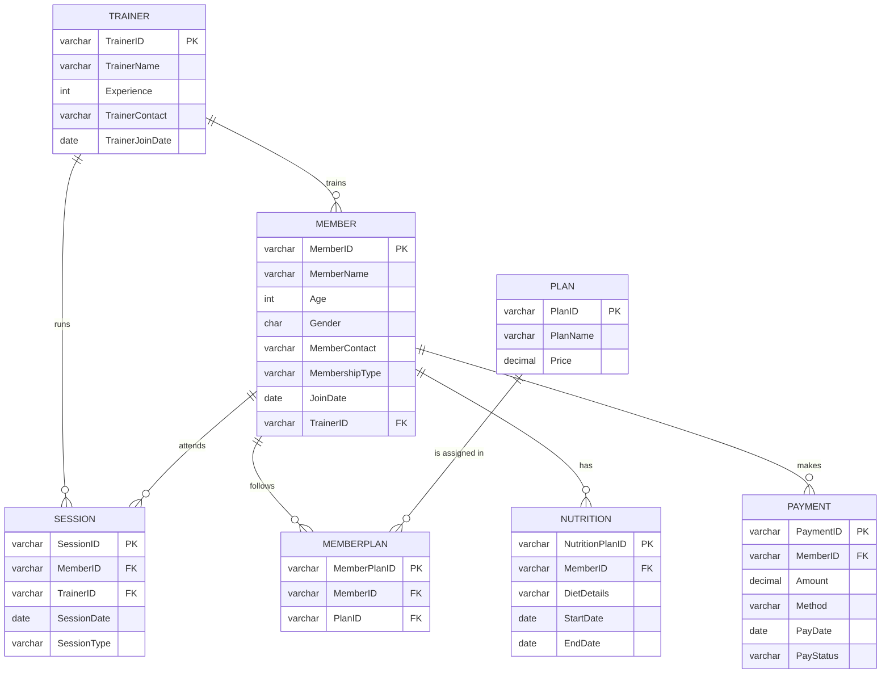

# Smart Fitness Centre Database (MySQL)

A relational database for a fitness centre, built for a second-year Data and Distributed Systems module. Many gyms still manage memberships, trainer schedules, diet plans and payments with separate records, which leads to errors and missed renewals. This project brings all of that into one structured MySQL database, with role-based access so trainers and members only see the data they need.

## Requirements
**Functional**
- Register and manage member details
- Store trainer details and experience, and assign trainers to members
- Record the fitness plans each member follows (monthly and annual memberships)
- Record training sessions and personalised nutrition plans
- Record payments and their status, and support reporting queries

**Non-functional**
- Data integrity through constraints (PK, FK, NOT NULL, CHECK)
- Fast retrieval of member information
- Able to grow with more members, trainers and plans
- Restricted access to data through user roles

## Design process
1. Gathered requirements for a typical fitness centre
2. Identified entities and relationships and drew an ER diagram
3. Normalised the data from UNF through 1NF and 2NF to **3NF** (for example, splitting members and plans into a separate `MemberPlan` table)
4. Implemented and tested the schema in **MySQL Workbench**

## ER diagram


## Constraints
Primary and foreign keys on every table, `NOT NULL` on all required fields, and `CHECK` rules: price and payment amount must be positive, age must be over 12, and gender is limited to M, F or O.

## Security – role-based access control
| Role | Can read | Demo user |
|---|---|---|
| `trainer_role` | Members, sessions, nutrition plans | `trainer1` |
| `member_role` | Payments, plans, member plans, sessions, trainers | `member1` |

## Example queries
The script includes queries for each role, using `JOIN`s:
- **Trainer:** their assigned members, their sessions, and their members' nutrition plans
- **Member:** their payment history, their plans and prices, their sessions, and their trainer's details

## How to run
Requires **MySQL 8.0.16+** (for roles and `CHECK` constraints). Open `smart_fitness_db.sql` in MySQL Workbench and run the whole script, or:
```bash
mysql -u root -p < smart_fitness_db.sql
```

## Future improvements
- Add an `Equipment` table to track machines and maintenance schedules
- Add session times and trainer specialisations
- Make contact numbers `UNIQUE` and add an administrator role with full access

## Tech stack
MySQL 8, MySQL Workbench, SQL (DDL, DML, JOINs, roles and privileges)
